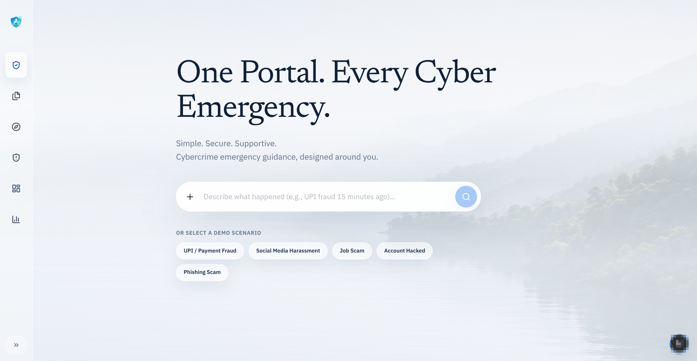

# CyberSaathi



CyberSaathi is a cybercrime-first emergency navigator built for Hack4SOC 3.0.
It helps a victim explain what happened, understand urgency, prepare the right
complaint material, and see seeded fraud intelligence without calling any real
government, police, bank, WhatsApp, or RTI service.

## What It Does

- Conversational intake for cyber-fraud and online safety cases
- Golden Hour guidance with 1930 call prep and reference capture
- Post-report workflows with NCRP draft, bank email, evidence timeline, and checklist
- Seed-data scam similarity, India heatmap, public/journalist/police dashboards
- Police admin portal with database-backed login, complaint review, notes, status updates, and export
- Simulated integrations only, with privacy redaction for sensitive data

## Tech Stack

- Frontend: Next.js 16, React 19, TypeScript, Tailwind CSS v4
- Backend: FastAPI, Pydantic, SQLAlchemy, Alembic
- Database: PostgreSQL/PostGIS
- Demo intelligence: deterministic rules, seeded data, mock adapters

## Run Locally

Start Postgres:

```bash
docker compose up -d postgres
```

Run the API:

```bash
cd apps/api
PYTHONPATH=.:../../packages uv run alembic upgrade head
PYTHONPATH=.:../../packages uv run python -m app.seed.seed_postgres
PYTHONPATH=.:../../packages uv run python run_api.py
```

Run the web app:

```bash
cd apps/web
npm install
NEXT_PUBLIC_API_BASE_URL=http://127.0.0.1:8000 npm run dev
```

Open `http://127.0.0.1:3000`.

Demo police login:

```text
Officer ID: admin
Password: admin
```

## Verify Before Deploying

```bash
cd apps/api
PYTHONPATH=.:../../packages uv run pytest

cd ../web
npm run typecheck
npm run lint
npm run build
```

## Deployment Notes

Set the web app API URL:

```bash
NEXT_PUBLIC_API_BASE_URL=https://your-api-host
```

Set a real admin JWT secret for deployed API instances:

```bash
ADMIN_JWT_SECRET=change-this-to-a-long-random-secret
```

Use PostgreSQL in normal runtime. `DATABASE_ENABLED=false` is only for explicit
in-memory fallback demos or isolated tests.

## Safety

- The app does not file FIRs or submit real government forms.
- It does not call real 1930, NCRP, bank, police, WhatsApp, RTI, or journalist systems.
- It never promises fund recovery.
- Aadhaar, PAN, OTPs, PINs, passwords, full card numbers, and bank credentials must not be stored or shown.

## Team

Team AETOS

Builders: Vishruth M R, Akshay Hudedmani, Nandan Kumar C.

## License

MIT License. See [LICENSE](LICENSE).
